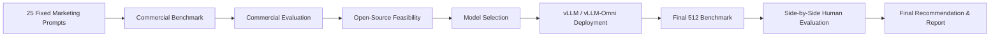

C:\Users\salmr\beamdata-go-to-market-image-generation>type README.md

# AIDC Capstone ظ¤ Image Generation Model Evaluation & Deployment

**Use Case 6: Go-to-Market Content Generation**
**Team Progress Snapshot ظ¤ 21 Sep 2026**

> **Current status:** Commercial benchmarking and evaluation are complete. Open-source feasibility testing is substantially complete. We are now validating the strongest final candidates through vLLM/vLLM-Omni and preparing the final deployment, authenticated API, side-by-side evaluation, and report.

---

## 1. Project Goal

Evaluate whether open-source image-generation models can be a practical alternative or complement to the commercial image-generation models used by the platform.

The final solution must balance:

- Image quality
- Prompt adherence
- Generation latency
- Reliability
- GPU / VRAM usage
- vLLM / vLLM-Omni compatibility
- Deployment complexity
- Licensing suitability
- API access and authentication

The target deployment environment should be designed with **approximately 16 GB VRAM** in mind.

---

## 2. Official Project Requirements ظ¤ Progress

| Requirement                                                 | Status                                                    |
| ----------------------------------------------------------- | --------------------------------------------------------- |
| Fixed benchmark of 25 prompts across 5 marketing categories | ظ£à Complete                                              |
| Benchmark 3 commercial models using the same prompts        | ظ£à Complete                                              |
| Commercial-model evaluation                                 | ظ£à Complete                                              |
| Evaluate initial open-source candidates                     | ظ£à Complete                                              |
| Investigate additional practical candidates where useful    | ظ£à Complete                                              |
| Select at least 2 open-source models for final deployment   | ≡ا¤ Final validation in progress                          |
| Deploy final models through vLLM / vLLM-Omni                | ≡ا¤ In progress                                           |
| Run final 512├ù512 benchmark: 25 prompts per selected model | ≡ا¤ In progress                                           |
| Record latency, peak VRAM, failures, image references, etc. | ظ£à Implemented                                           |
| Containerized inference services                            | ≡ا¤ Final deployment pending                              |
| HTTP API for each selected model                            | ≡ا¤ Prototype serving validated; final deployment pending |
| API key / Bearer authentication                             | ظ│ Pending                                                |
| Side-by-side human evaluation                               | ظ│ Pending                                                |
| Final technical report and presentation                     | ≡ا¤ In progress                                           |

---

## 3. Project Workflow



---

# Phase 1 ظ¤ Commercial Benchmark

## Goal

Establish a fixed baseline using the same 25 marketing prompts for the three commercial image-generation models.

## Models

- OpenAI GPT Image 2
- Black Forest Labs FLUX 2 Pro
- Google Gemini 3.1 Flash Image / Nano Banana 2

## Benchmark Structure

- **5 categories**
- **5 prompts per category**
- **25 prompts per model**
- **75 commercial benchmark images total**

### Categories

1. People & Lifestyle
2. Text & Typography
3. Branding & Advertising
4. Products & Physical Objects
5. Complex Compositions

### Status

**ظ£à COMPLETE**

The same prompt set is now reused throughout open-source evaluation so that comparisons remain consistent.

---

# Phase 2 ظ¤ Commercial Evaluation

## Goal

Create the quality baseline that open-source candidates will be compared against.

### Status

**ظ£à COMPLETE**

Commercial outputs were generated and evaluated using the shared benchmark prompt set.

---

# Phase 3 ظ¤ Open-Source Model Feasibility

## Goal

Determine which open-source models are practical candidates for final deployment.

The feasibility stage evaluates:

- Model loading
- 512×512 generation
- vLLM / vLLM-Omni compatibility
- Latency
- Peak VRAM
- Reliability
- Image quality / prompt adherence
- Runtime requirements
- Deployment complexity

---

## 4. Open-Source Models Tested

### 512×512 Results

| Model                           |     Result |       Avg Latency |           Peak VRAM | vLLM / Omni | Visual Outcome                                              | Current Decision                  |
| ------------------------------- | ---------: | ----------------: | ------------------: | ----------- | ----------------------------------------------------------- | --------------------------------- |
| **FLUX.2 Klein 4B**             |      25/25 |        **5.20 s** |       **34.08 GiB** | ظ£à         | Good, but more visible errors than Z in our outputs         | Candidate                         |
| **Stable Diffusion 3.5 Medium** |      25/25 |        **1.24 s** |       **31.62 GiB** | ظ£à         | **Visually very poor in our tested outputs**                | **Excluded from final shortlist** |
| **SDXL Base 1.0**               |      25/25 |        **4.44 s** |        **8.22 GiB** | ظ£à         | **Visually very poor / unacceptable in our tested outputs** | **Excluded from final shortlist** |
| **Z-Image-Turbo**               |      25/25 |       **19.14 s** |       **21.11 GiB** | ظ£à         | Very good; fewer visual errors than FLUX in our review      | **Strong candidate**              |
| **Qwen-Image-2.1 ظ¤ vLLM-Omni** |      25/25 |         **7.77s** |       **34,03 GiB** | ظ£à         | Full API benchmark completed successfully                   | **Strong candidate**              |
| **OmniGen2**                    | Smoke test | ~6.08 s wall time | ~23.26 GiB observed | ظ£à         | Acceptable image; weak generated text                       | Feasibility only                  |

> **Important:** VRAM figures should be compared together with the runtime configuration. Measurements from different serving paths are not automatically equivalent.

---

## 5. 1024×1024 Follow-Up Tests

1024×1024 is a useful follow-up test for quality and scaling behavior, but the minimum required open-source benchmark remains 512×512.

| Model                               | Result | Avg Latency |     Peak VRAM | Status                     |
| ----------------------------------- | -----: | ----------: | ------------: | -------------------------- |
| **FLUX.2 Klein 4B**                 |  25/25 | **16.91 s** | **19.46 GiB** | ظ£à Complete               |
| **Stable Diffusion 3.5 Medium**     |  25/25 |  **4.09 s** | **20.39 GiB** | ظ£à Complete               |
| **Qwen-Image-2.1 ظ¤ Diffusers run** |  25/25 | **77.47 s** | **16.95 GiB** | ظ£à Complete               |
| **Z-Image-Turbo**                   |     ظ¤ |          ظ¤ |            ظ¤ | ظ│ Planned if time permits |

---

# 6. Key Engineering Finding ظ¤ Qwen-Image-2.1 on vLLM-Omni

Qwen-Image-2.1 initially failed to start through the existing vLLM-Omni image with:

```text
Model class QwenImage21Pipeline not found in diffusion model registry
```

## Root Cause

The existing vLLM-Omni build did not contain the `QwenImage21Pipeline` implementation required by Qwen-Image-2.1.

## Resolution

We:

1. Checked the latest vLLM-Omni source.
2. Located the Qwen-Image-2.1 implementation in the dedicated upstream PR branch.
3. Verified that the branch registers `QwenImage21Pipeline`.
4. Installed the compatible vLLM 0.29.0 CUDA build.
5. Started Qwen-Image-2.1 through `vllm serve --omni`.
6. Verified that the vLLM-Omni API server started successfully.
7. Sent a real request to `/v1/images/generations` and received a generated image successfully.

### Current vLLM-Omni Serving Status

**ظ£à Qwen-Image-2.1 is now successfully serving through vLLM-Omni.**

Observed during startup:

- `QwenImage21Pipeline` detected successfully
- Model loaded successfully
- Pure diffusion API server initialized
- `/v1/images/generations` available
- Application startup completed
- One 512×512 API smoke request completed in approximately **7 seconds end-to-end**
- vLLM-Omni reported approximately **30.55 GiB GPU memory after model loading** in the current configuration

### Why This Matters

This removes the major technical blocker that previously prevented Qwen-Image-2.1 from being considered for the final vLLM/vLLM-Omni deployment requirement.

The **full 25-prompt benchmark through the vLLM-Omni API is now complete (25/25 successful)**. The final supplied runs completed at ~7.8 seconds each, and the observed GPU memory reached **34,845 MiB (~34.03 GiB)** in the final prompt. A complete CSV summary will be used for the official average / median / min / max latency and full-run peak VRAM.

---

# 7. Current Shortlist

## Final Candidates Under Comparison

The current shortlist is now **three models only**:

1. **FLUX.2 Klein 4B**
2. **Qwen-Image-2.1**
3. **Z-Image-Turbo**

These three remain under final comparison using image quality, prompt adherence, latency, VRAM, reliability, vLLM/vLLM-Omni compatibility, and deployment complexity.

### FLUX.2 Klein 4B

**Why it remains a candidate:**

- 25/25 successful 512 benchmark
- vLLM/vLLM-Omni serving demonstrated
- Fast generation compared with Z and Qwen
- 5.20 s average latency in the recorded 512 run

**Main trade-offs:**

- 34.08 GiB peak VRAM in the recorded 512 run
- More visible generation errors than Z in our visual review

### Qwen-Image-2.1

**Why it is a strong candidate:**

- 25/25 successful 512 benchmark through Diffusers
- **25/25 successful 512 benchmark through the actual vLLM-Omni HTTP API**
- Strong image quality in our review
- Qwen vLLM-Omni compatibility blocker has been solved
- Real `/v1/images/generations` serving path validated
- Final benchmark requests completed successfully, with the last runs around **7.8 s/image**

**Current trade-offs / items to summarize:**

- vLLM-Omni uses substantially more VRAM than the previous Diffusers benchmark
- Final supplied run reached **34,845 MiB (~34.03 GiB)**
- Full CSV summary is still needed for official average / median / min / max latency and full-run peak VRAM
- Final license suitability still needs to be documented

### Z-Image-Turbo

**Why it remains a strong candidate:**

- 25/25 successful benchmark
- Very good visual quality in our review
- Fewer visible generation errors than FLUX in our tested outputs
- vLLM-Omni serving demonstrated
- Reasonable deployment path

**Main trade-offs:**

- 21.11 GiB peak VRAM in the recorded 512 run
- ~19.14 s average latency

---

# 8. Models Not Selected for the Current Final Shortlist

## Stable Diffusion 3.5 Medium

The model was technically fast and reliable, but **the visual outputs were very poor in our evaluation**, so it is not being considered for the final shortlist despite strong latency numbers.

**Engineering conclusion:** exclude it because image quality / prompt adherence is a core project requirement, not just latency.

## SDXL Base 1.0

The model was technically efficient in VRAM and latency, but **the visual outputs were also very poor / unacceptable in the tested configuration**, including weak prompt adherence. A diagnostic FP32 test did not solve the observed output problem.

**Engineering conclusion:** exclude the tested SDXL configuration from the final shortlist.

## OmniGen2

Successfully loaded and generated an image, but only a smoke test was completed. Generated text quality was weaker, and the project already has three stronger candidates with more complete benchmark evidence.

---

# 9. Benchmark Evidence Collected

For benchmarked models we record, where applicable:

- `run_id`
- `prompt_id`
- `prompt`
- `category`
- `model`
- `width`
- `height`
- `generation_time_seconds`
- `peak_vram`
- `GPU`
- `success`
- `error`
- `image_path`
- `timestamp`
- runtime settings such as seed / steps / guidance

This allows the final model choice to be justified using measured evidence rather than assumptions.

---

# 10. Current Project Status

```text
Commercial benchmark              ظûêظûêظûêظûêظûêظûêظûêظûêظûêظûê 100% ظ£à
Commercial evaluation             ظûêظûêظûêظûêظûêظûêظûêظûêظûêظûê 100% ظ£à
OSS feasibility testing            ظûêظûêظûêظûêظûêظûêظûêظûêظûêظûّ  90% ≡ا¤
Final candidate validation         ظûêظûêظûêظûêظûêظûêظûêظûêظûêظûّ  90% ≡ا¤
vLLM/Omni serving validation       ظûêظûêظûêظûêظûêظûêظûêظûêظûêظûê 100% ظ£à
Final 512 benchmarks               ظûêظûêظûêظûêظûêظûêظûêظûêظûêظûّ  90% ≡ا¤
Authenticated final API            ظûêظûêظûêظûّظûّظûّظûّظûّظûّظûّ  30% ≡ا¤
Side-by-side human evaluation      ظûêظûêظûّظûّظûّظûّظûّظûّظûّظûّ  20% ظ│
Final report & presentation        ظûêظûêظûêظûêظûّظûّظûّظûّظûّظûّ  40% ≡ا¤
```

> Percentages are a progress communication aid, not formal project scoring.

---

# 11. What We Are Doing Right Now

### Current Task

Summarize the newly completed **Qwen-Image-2.1 vLLM-Omni 25/25 benchmark** and compare it directly with **FLUX.2 Klein 4B** and **Z-Image-Turbo**.

### Goal

Produce the final evidence table for the three remaining candidates using the same decision criteria: image quality, prompt adherence, latency, VRAM, reliability, and serving compatibility.

### Latest Qwen Result

- **25/25 prompts completed successfully through vLLM-Omni**
- Last four prompts (`CC-02` ظْ `CC-05`) each completed in approximately **7.8 s**
- Highest VRAM value visible in the supplied final rows: **34,845 MiB (~34.03 GiB)**
- No failures were reported in the completed run
- Full CSV summary is the next step for exact average / median / min / max and full-run peak VRAM

---

# 12. Immediate Next Steps

1. **Summarize the completed Qwen vLLM-Omni CSV**
2. **Compare FLUX vs Qwen vs Z using the official selection criteria**
3. **Perform visual side-by-side review of the three candidates**
4. **Confirm the final two models**
5. **Containerize / finalize Kubernetes inference services**
6. **Add Bearer-token or API-key authentication**
7. **Run the final side-by-side human evaluation**
8. **Complete final benchmark comparison and recommendation**
9. **Finish technical report and presentation**

### Optional if time remains

- Test Z-Image-Turbo at 1024×1024
- Explore runtime / VRAM optimization for Qwen
- LoRA experimentation only if core project requirements are already complete

---

# 13. Quick Presentation Summary

## What have we completed?

- Built the fixed 25-prompt commercial benchmark
- Completed the commercial-model benchmark and evaluation
- Tested multiple open-source image models
- Collected latency, VRAM, reliability, and image outputs
- Excluded **SDXL Base** and **Stable Diffusion 3.5 Medium** because their tested visual outputs were very poor
- Identified **FLUX.2 Klein, Qwen-Image-2.1, and Z-Image-Turbo** as the three current finalists
- Diagnosed and solved the Qwen-Image-2.1 vLLM-Omni compatibility blocker
- Successfully completed **25/25 Qwen images through the vLLM-Omni HTTP API**

## Where are we now?

**Final candidate validation and deployment benchmarking.**

The Qwen-Image-2.1 25-prompt vLLM-Omni benchmark is **complete (25/25)**. We are now comparing **FLUX vs Qwen vs Z** and preparing the final two-model selection.

## What is next?

Summarize Qwen performance, compare **FLUX vs Qwen vs Z**, select the final two models, add authenticated production-style endpoints, complete side-by-side human evaluation, and finish the final report.

---

# 14. Current Technical Takeaway

The project has moved beyond simply proving that open-source models can generate images.

We are now comparing **deployable inference services** using measurable engineering criteria:

**quality + prompt adherence + latency + VRAM + reliability + serving compatibility + deployment complexity.**

The strongest current progress is the successful transition of **Qwen-Image-2.1 from standalone experimentation to a complete 25/25 vLLM-Omni API benchmark**. The final shortlist is now **FLUX.2 Klein + Qwen-Image-2.1 + Z-Image-Turbo**, while SDXL and SD3.5 have been excluded due to poor visual results in our testing.

C:\Users\salmr\beamdata-go-to-market-image-generation>
