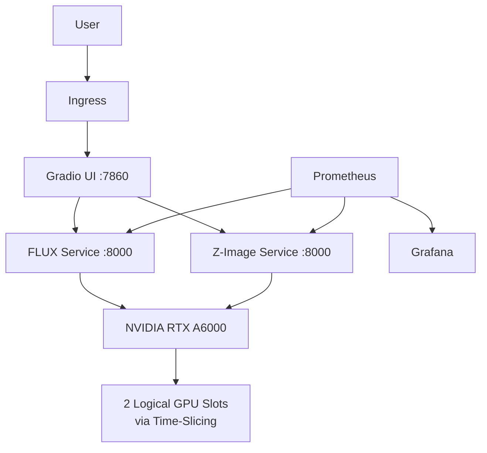

# 🖼️ Image Generation Model Evaluation & Deployment

<p align="center">
  <strong>BeamData · AI Data Center Capstone · Team 6</strong><br>
  Evaluation, deployment, and infrastructure benchmarking of commercial and open-source image-generation models.
</p>

<p align="center">
  
  
  
  
  
</p>

---

## 🎯 Project Overview

This project evaluates whether self-hosted open-source image-generation models can serve as practical alternatives or complements to commercial image-generation APIs used in marketing workflows.

The project covers the full path from **benchmarking and human evaluation** to **containerized model serving, authenticated APIs, Kubernetes deployment, GPU sharing, monitoring, and a Gradio frontend**.

### Core evaluation criteria

- Image quality and prompt adherence
- Generation latency and reliability
- GPU / VRAM usage
- Cost where verifiable
- vLLM / vLLM-Omni compatibility
- Docker and Kubernetes deployment
- Authenticated HTTP inference
- Human preference and ranking

---

## ✅ What Was Delivered

| Area | Delivered |
|---|---|
| Commercial benchmark | 3 commercial models × 25 fixed prompts |
| Open-source feasibility | Multiple candidate models investigated |
| Final OSS models | FLUX.2 Klein 4B Q4_K_M + Z-Image-Turbo W4 |
| OSS benchmark | 25 prompts/model at 512×512 |
| Inference serving | vLLM / vLLM-Omni |
| Containerization | Docker |
| API | Authenticated HTTP image-generation endpoints |
| Frontend | Gradio application |
| Orchestration | k3s / Kubernetes |
| GPU sharing | NVIDIA GPU time-slicing |
| Monitoring | Prometheus + Grafana manifests |
| Human evaluation | Commercial rubric + blind preference + five-model ranking |
| Analysis | CSV/XLSX benchmark and evaluation outputs |

---

## 🧭 End-to-End Workflow


---

## 🧪 Benchmark Design

A fixed set of **25 prompts across five marketing categories** was used to keep evaluation consistent:

1. People & Lifestyle
2. Text & Typography
3. Branding & Advertising
4. Products & Physical Objects
5. Complex Compositions

Commercial APIs were benchmarked at **1024×1024**.  
The required final open-source benchmark was performed at **512×512**.

> Latency values across commercial and open-source models should be interpreted within their respective benchmark resolutions.

---

## 📊 Key Results

### Commercial baseline

| Model | Avg. Generation Time | Success Rate | Cost / Image |
|---|---:|---:|---:|
| GPT Image 2 | 44.83 s | 100% | $0.0500 |
| FLUX 2 Pro | 15.28 s | 100% | $0.0315 |
| Gemini 3.1 Flash Image | 8.91 s | 100% | $0.0670 |

### Final open-source models

| Model | Avg. Generation Time | Peak VRAM | Success Rate |
|---|---:|---:|---:|
| FLUX.2 Klein 4B Q4_K_M | **6.705 s** | 11.67 GB | 25/25 |
| Z-Image-Turbo W4 | **14.554 s** | 7.86 GB | 25/25 |

Both selected models completed the required benchmark with **zero recorded failures**.

> The open-source models were tested on an NVIDIA RTX A6000 with 48 GB VRAM. Each model individually remained below the project’s ~16 GB VRAM target in the recorded benchmark, but a physical 16 GB GPU was not tested directly.

### Five-model human ranking

Each model received **75 ranking evaluations**, with Rank 1 representing the most preferred output.

| Model | Average Rank | Top-3 Count | Top-3 Rate |
|---|---:|---:|---:|
| GPT Image 2 | 2.51 | 54 | 72.0% |
| Gemini 3.1 Flash Image | 2.69 | 52 | 69.3% |
| FLUX 2 Pro | 2.91 | 47 | 62.7% |
| Z-Image-Turbo W4 | 3.29 | 40 | 53.3% |
| FLUX.2 Klein 4B Q4_K_M | 3.60 | 32 | 42.7% |

The ranking results are reported separately from the commercial 1–5 rubric evaluation.

---

## 🏗️ Deployment Architecture

The final implementation includes:

- **FLUX.2 Klein** and **Z-Image-Turbo** served through vLLM-Omni
- Separate Dockerized model services
- Bearer token / API-key authentication
- Gradio frontend
- k3s / Kubernetes manifests
- NVIDIA GPU time-slicing
- Ingress configuration
- Network policy
- Prometheus and Grafana deployment manifests



> GPU time-slicing enables scheduler-level sharing of one physical GPU. It does **not** provide VRAM isolation; both workloads still share the same physical GPU memory and compute resources.

---

## 🛠️ Key Infrastructure Challenges Solved

### 1. Two GPU workloads on one physical GPU
Kubernetes initially exposed the RTX A6000 as a single `nvidia.com/gpu` resource. NVIDIA Device Plugin time-slicing was configured to expose **two logical GPU slots**, allowing both model Deployments to remain scheduled independently.

### 2. Kubernetes `DiskPressure`
Docker images, containerd snapshots, model files, Hugging Face caches, and Python environments consumed significant shared storage. Unused environments were removed carefully while preserving active model assets and caches.

### 3. Docker vs. k3s/containerd image stores
Images available in Docker were not automatically visible to k3s. Required images were explicitly exported from Docker and imported into the k3s containerd image store.

### 4. Rolling updates with limited GPU capacity
Default rolling updates could request an additional GPU-backed Pod while both logical GPU slots were already occupied. Model Deployments were configured with:

```yaml
strategy:
  type: RollingUpdate
  rollingUpdate:
    maxSurge: 0
    maxUnavailable: 1
```

This prevents Kubernetes from attempting to schedule an extra GPU-consuming Pod during rollout.

---

## 🗂️ Repository Structure

```text
.
├── .github/
│   └── workflows/                 # Container build workflows
├── app/                           # Main Gradio application source
├── benchmark/
│   ├── prompts/                   # Fixed 25-prompt benchmark
│   ├── results/                   # Commercial + final OSS outputs
│   ├── run_commercial_benchmark.py
│   ├── run_open_source_benchmark.py
│   └── run_z_image_turbo_w4_benchmark.py
├── deployment/
│   ├── compose/                   # Docker Compose + monitoring config
│   ├── flux2-klein/               # FLUX container files
│   ├── z-image-turbo/             # Z-Image container files
│   └── k3s/
│       ├── app/                   # k3s-specific Gradio application variant
│       ├── frontend/              # Gradio Deployment / Service
│       ├── gpu-sharing/           # NVIDIA time-slicing config
│       ├── ingress/               # Ingress configuration
│       ├── models/                # Model Deployments / Services
│       ├── monitoring/            # Prometheus + Grafana
│       └── network-policy/        # Kubernetes network policy
├── evaluation/
│   ├── app/                       # Blind preference interface
│   ├── data/                      # Raw evaluation inputs
│   ├── results/                   # Processed results and analysis
│   └── scripts/                   # Evaluation / aggregation scripts
├── scripts/                       # Supporting validation utilities
├── compose.yaml
├── .env.example
└── README.md
```

### Why are there two Gradio app locations?

- `app/` contains the **main application source**.
- `deployment/k3s/app/` contains the **k3s deployment-specific variant**, including environment-specific behavior such as proxy routing, deployment dependencies, and validated 512×512 FLUX settings.

Both are intentionally retained because they serve different deployment contexts.

---

## 🚀 Where to Start

| Goal | Start Here |
|---|---|
| Understand the frontend | [`app/README.md`](app/README.md) |
| Review benchmark prompts | [`benchmark/prompts/README.md`](benchmark/prompts/README.md) |
| Review evaluation workflow | [`evaluation/README.md`](evaluation/README.md) |
| Review deployment | [`deployment/README.md`](deployment/README.md) |
| Review k3s setup | [`deployment/k3s/README.md`](deployment/k3s/README.md) |
| Review deployment validation | [`deployment/VALIDATION.md`](deployment/VALIDATION.md) |

---

## ⚠️ Important Limitations

- Commercial models were benchmarked at 1024×1024 while the final OSS benchmark used 512×512.
- Open-source cost per image was not calculated because a verified GPU hourly rate was unavailable.
- Production-scale concurrency and sustained load were not fully evaluated.
- The open-source models were validated on one NVIDIA RTX A6000 environment.
- Human evaluation used a limited evaluator pool.

---

## 🔭 Next Steps

- Production concurrency and sustained-load testing
- Verified GPU cost measurement
- 1024×1024 production-resolution testing for selected OSS models
- Further vLLM / vLLM-Omni optimization
- Expanded human evaluation
- BeamData AI Hub integration
- Stronger observability and operational automation

---

## 📌 Final Takeaway

The project demonstrated that **self-hosted image generation is technically feasible** using the selected open-source models.

**FLUX.2 Klein 4B Q4_K_M** provided lower generation latency, while **Z-Image-Turbo W4** used less VRAM. Both were successfully served through the project’s containerized and Kubernetes-based infrastructure with authenticated API access.

The final implementation provides BeamData with a measurable basis for comparing **managed commercial APIs** against **self-hosted open-source inference** across quality, latency, reliability, infrastructure usage, and operational complexity.

---

<p align="center">
  <strong>BeamData · AI Data Center Capstone · Team 6</strong>
</p>
